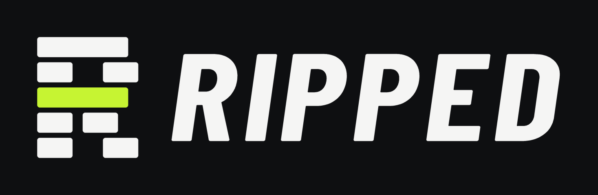

<p align="center">
  
</p>

# Ripped

A minimalist, offline-first workout app for Android, built with Flutter.
You answer a few questions, get a strength plan built for you, log each set
with one tap, and the plan adapts as you get stronger. No ads, no paywall,
and an account is optional.

- **Package / app id:** `ripped` / `com.ornobaadi.ripped`
- **Platform:** Android (Google Play). iOS is planned; web runs for quick previews only.
- **Language:** English only, global audience.
- **Version:** 1.0.0+1 (pre-release; closed testing not started yet)

> **For AI agents and new contributors:** this README is the map.
> [`CLAUDE.md`](CLAUDE.md) holds the working rules and gotchas, and
> [`DECISIONS.md`](DECISIONS.md) records why things are the way they are.
> Read those two before changing code.

---

## Contents

1. [What the app does](#what-the-app-does)
2. [Project status](#project-status)
3. [Tech stack](#tech-stack)
4. [Architecture](#architecture)
5. [Repository layout](#repository-layout)
6. [Getting started](#getting-started)
7. [Commands](#commands)
8. [Configuration](#configuration)
9. [Data, sync and backend](#data-sync-and-backend)
10. [Exercise catalog and media](#exercise-catalog-and-media)
11. [Design system](#design-system)
12. [Notifications and haptics](#notifications-and-haptics)
13. [Privacy and analytics](#privacy-and-analytics)
14. [Testing](#testing)
15. [Documentation index](#documentation-index)
16. [Rules for contributors](#rules-for-contributors)
17. [Known gaps and roadmap](#known-gaps-and-roadmap)
18. [Credits](#credits)

---

## What the app does

### Onboarding and plan
- Seven short questions: goal, experience, equipment, days per week, how to
  split the week, session length, joints to go easy on. Every question can
  be skipped.
- **Training split with a coach's default.** "Coach's pick" comes first;
  the alternatives are Full body, Upper / Lower, Push / Pull / Legs and
  Body part days ("chest day, leg day"). Each option shows the week it
  would produce in plain words.
- A deterministic, rules-based generator builds the plan from the bundled
  catalog: it respects equipment, experience and the joints to avoid, and
  gives a reason for each exercise.
- While the plan is built, the person's own answers tick off one by one;
  the plan then opens with a "Built for you" summary.
- **The plan is fully editable:** reorder, add, remove and swap exercises,
  change sets / reps / rest, rename a day, or rebuild a whole day around
  any mix of body parts (for example chest and shoulders together).

### Training
- **Today** shows one clear next action: the workout in turn, a rest day,
  or "done for today".
- **Focus workout view:** one set on screen at a time, the exercise demo,
  the target in large type, a line of encouragement, and a single large
  "Set done" button. After a set, a full-width rest countdown takes over.
  A progress strip shows the whole workout. Every set stays editable from
  an "All sets" sheet.
- **Adaptive progression:** hit the top of the rep range and the weight
  goes up next time; stall and it adjusts. At most one step per session.
- **Missed a workout?** The app says so without blame and offers: do it
  today, do both, skip it, or keep it for the next training day. Any
  workout in the plan can also be picked by hand.
- **Recovery coaching (optional offers):** an "easy week" after three
  tough sessions in a row or six straight weeks, and a plan refresh after
  eight weeks.

### Motivation
- XP and levels, weekly streaks with one free "shield" a month, personal
  records, and 32 achievements (five hidden).
- **Workout summary** with a personal line chosen from what just happened,
  confetti for records, level-ups, completed weeks and new badges.
- **Progress tab:** this week's totals, sets per muscle group, streak
  calendar, records, a strength chart per lift, and history.
- **Share card:** a branded image of the week in Post (1080 x 1350) or
  Story (1080 x 1920) size, in the colours of the logo you picked. Totals
  only, nothing personal.
- **Logo:** Volt, Ember or Chalk (You > Logo), used in the app and on
  share cards.

### Account and data (all optional)
- Works fully offline with no account.
- Optional Google sign-in backs data up and syncs it between phones.
- Export everything (JSON + CSV), delete the account in-app, light / dark /
  match-phone theme, kg or lb.

---

## Project status

Build order and exit criteria live in [`phases.md`](phases.md).

| Phase | Scope | State |
|---|---|---|
| 0 | Foundations: tokens, components, CI-style checks | Done |
| 1 | Core loop, offline | Done |
| 2 | XP, streaks, records, reminders | Done |
| 3 | Google sign-in, sync, server security, export, legal | Done (RevenueCat and remote config deferred to Phase 7) |
| 4 | Polish and closed beta | Code done; Play Console setup and testers are the owner's next step |
| 5 | Public launch | Code done (analytics delivery, review prompt, launch guide) |
| 6 | Retention | In progress: achievements, weekly recap, muscle balance, easy week, training splits, plan editing, missed-day handling. Open: home-screen widget, Health Connect |
| 7 | Pro subscription | Not started |

The most recent work (focus workout view, plan editing, training splits,
share card, haptics, missed-day handling, notification rules) passes the
automated tests but still needs a full check on a phone.

---

## Tech stack

| Area | Choice |
|---|---|
| Framework | Flutter 3.47, Dart 3.13 |
| State | Riverpod 3, **no code generation** (plain `Provider` / `StreamProvider`) |
| Navigation | go_router (three-tab shell + modal routes) |
| Local database | Drift (SQLite), schema v3, the single source of truth |
| Backend (optional) | Supabase: Auth (Google), Postgres with row-level security, one Edge Function |
| Sync | Custom outbox sync (SQLite triggers, last write wins, soft deletes) |
| Notifications | flutter_local_notifications (local only, no push) |
| Haptics | `vibration` package behind one `Haptics` service |
| Media | video_player (bundled MP4), Lottie slot for plan animations |
| Monitoring | Sentry (crashes), PostHog over plain HTTPS (anonymous usage) |
| Lints | very_good_analysis |

Rejected on purpose: Isar, Hive, Firestore as the primary store, and any
runtime hot-linking of third-party media.

---

## Architecture

```
Presentation (features/*/presentation)   widgets, screens, sheets
        |
Providers (app/providers.dart)           the Riverpod graph
        |
Data (features/*/data, core/*)           repositories over Drift, sync, services
        |
Domain (lib/domain)                      PURE DART rules, no Flutter imports
```

- **`lib/domain/` is pure Dart** and holds every rule: plan generation,
  training splits, progression, schedule and missed days, XP, streaks,
  records, achievements, recaps, recovery advice, encouragement, and which
  notifications to send. It is unit-tested to 90%+ coverage.
- **Local first:** the network is never needed for a workout and the app
  does no network work at startup. Sign-in and sync start in the
  background.
- **Derived, not stored:** levels, streaks, achievements, recaps and muscle
  balance are computed from the workout log every time. Only the log, the
  plan and append-only XP events are persisted.
- **Device preferences** (theme, reminders,
  haptics, coaching choices, training style, analytics opt-out) live in a
  local key/value `settings` table and are not synced.

---

## Repository layout

```
lib/
  app/                 bootstrap, App widget, router, providers, config
  core/
    analytics/         event allow-list, PostHog client
    auth/              Google sign-in via Supabase
    catalog/           loads the bundled exercise catalog (native + web)
    db/                Drift database, tables, settings repository
    design/            tokens, theme, shared components
    haptics/           the only door to vibration
    notifications/     local notification scheduler
    review/            Play in-app review
    sync/              outbox sync service and Supabase transport
    utils/             formatting (kg <-> lb, durations)
  domain/              PURE DART
    catalog/           exercise model
    plan/              profile, plan, generator, training styles, schedule
    progression/       progression engine
    gamification/      XP, levels, streaks
    records/           personal records
    insights/          achievements, weekly recap, muscle balance, recovery
    engagement/        encouragement, review prompt, notification planner
  features/
    onboarding/ plan/ today/ workout/ exercise/ progress/ settings/
  l10n/                ARB source and generated localizations
assets/
  catalog/             catalog.sqlite, images, videos (generated)
  legal/               privacy, terms, delete-account (Markdown)
  anim/                Lottie files (slot; none added yet)
  brand/               logo kit: svg/ and png/ in every colourway (not bundled)
  fonts/               Inter, Barlow Condensed
docs/                  generated legal pages for GitHub Pages
supabase/              migrations, RLS tests, delete-account function
tool/                  catalog builder, legal page builder, icon generator
test/                  unit, widget, golden and migration tests
env/                   per-flavor config (examples committed, real files ignored)
```

---

## Getting started

Requirements: Flutter 3.47+, a connected Android device or emulator.
Python 3 and ffmpeg are only needed for the tooling under `tool/`.

```bash
flutter pub get
```

Create your local config (the real files are git-ignored):

```bash
cp env/dev.example.json env/dev.json
```

Leave the values empty to run fully offline. Then:

```bash
flutter run --flavor dev -t lib/main_dev.dart --dart-define-from-file=env/dev.json
```

Android has three product flavors (`dev`, `staging`, `prod`), so `run` and
`build` always need `--flavor` and the matching entry point.

For a quick layout check in Chrome, run the same command and pick Chrome.
Reminders and Google sign-in do not work there.

---

## Commands

```bash
flutter analyze                                # must be clean
dart format .
flutter test                                   # unit + widget + golden
flutter test --update-goldens                  # then review the PNG diffs
flutter gen-l10n                               # after editing lib/l10n/arb/*.arb
dart run build_runner build -d                 # Drift code generation
dart run drift_dev make-migrations             # after bumping schemaVersion
flutter test --coverage && python tool/coverage_report.py   # domain gate (>= 90%)
dart run tool/build_catalog/build_catalog.dart # rebuild assets/catalog
python tool/build_legal.py                     # rebuild docs/*.html from assets/legal
python tool/gen_brand.py                       # logo kit, launcher icons, splash, store graphics
```

Release bundle (run by the owner):

```bash
flutter build appbundle --release --flavor prod -t lib/main_prod.dart --dart-define-from-file=env/prod.json --obfuscate --split-debug-info=build/symbols
```

---

## Configuration

Values come from `env/<flavor>.json` through `--dart-define-from-file` and
are read in [`lib/app/config.dart`](lib/app/config.dart). Every value is
optional; an empty value turns the feature off.

| Key | Enables |
|---|---|
| `SUPABASE_URL`, `SUPABASE_PUBLISHABLE_KEY` | Accounts and sync |
| `GOOGLE_WEB_CLIENT_ID` | Google sign-in |
| `SENTRY_DSN` | Crash reports |
| `POSTHOG_KEY`, `POSTHOG_HOST` | Anonymous usage analytics |
| `SUPPORT_EMAIL` | "Send feedback" in the You tab |

Only public keys belong in these files. Secret and service-role keys never
go into the app or the repository.

---

## Data, sync and backend

- **Local schema (Drift v3):** `profiles`, `programs`, `program_days`,
  `program_exercises`, `workouts`, `workout_exercises`, `workout_sets`,
  `exercise_states`, `xp_events`, `personal_records`, plus local-only
  `settings` and `sync_outbox`. Ids are client-generated UUIDv7; weights
  are stored in kg.
- **Sync:** SQLite triggers record changed rows in an outbox. Push upserts
  them; pull reads rows newer than the last server timestamp. Conflicts
  resolve by last write on `updated_at`. Rows are never hard-deleted
  (`deleted_at`). A device refuses to upload under a different account
  than the one it first synced with.
- **Server:** every table has row-level security forced on, a trigger that
  stamps the owner from the signed-in user, and no delete policy. Account
  deletion runs in an Edge Function with the service-role key.
- **Setup:** [`SETUP_BACKEND.md`](SETUP_BACKEND.md) walks through Supabase,
  Google Cloud OAuth and applying migrations.

---

## Exercise catalog and media

- 181 curated exercises in a read-only SQLite file bundled with the app.
  Curation (stable ids, movement pattern, joint stress, substitutes,
  priority) lives in `tool/build_catalog/curation.yaml`.
- 126 exercises have a looping demo video; the rest use two still photos.
  Videos are cropped to the moving figure, the white background is removed
  by flood fill, and each is baked for the dark and the light theme
  (540 px, about 37 MB in total). Nothing is streamed at runtime.
- Sources and licences are recorded in `assets/catalog/ATTRIBUTIONS.md`
  and shown in the app under You > Credits.

---

## Design system

Tokens and components are in `lib/core/design/`; the full specification is
[`design.md`](design.md).

- Dark by default, with a light theme and "match phone".
- One lime accent, used on at most one element per screen.
- Inter for text, Barlow Condensed for headings and numbers.
- Material Symbols Rounded icons; state is shown with the fill axis.
- A floating pill navigation bar whose selected tab expands with a spring.
- **Logo:** the Weight Stack R, an R built from the plates of a machine
  weight stack with one plate in the accent colour ("your level"). Three
  colourways: Volt (lime on black, the primary one), Ember and Chalk.
  `tool/gen_brand.py` generates every size and format from one definition:
  the kit in `assets/brand/`, the plates and colours the app draws
  (`lib/core/design/brand.dart`), the Android launcher, splash and
  notification icons, the Play Store icon and feature graphic in `store/`,
  and the web icons.
- Respects Reduce Motion and text scaling up to 200%. No red or shaming
  for missed days.

---

## Notifications and haptics

**Notifications** are local only (no server, no push token) and off until
the user turns reminders on. The list is rebuilt from current facts each
time the app opens, a workout is finished, or settings change, by
`NotificationPlanner` in `lib/domain/engagement/notification_plan.dart`:

- a reminder on the user's own training days, at their chosen time, naming
  the next workout;
- never on a day already trained;
- at most one catch-up, the day after a missed workout, and only when that
  day is not a training day with its own reminder;
- nothing beyond seven days, so someone who stopped opening the app is
  left alone.

There are no marketing, streak-pressure or "we miss you" notifications.

**Haptics** go through `Haptics.play(HapticCue)` in
`lib/core/haptics/haptics.dart`. Each cue has one meaning: a light tick for
controls, a firm pulse for a logged set, a double pulse for a finished
exercise, a strong double buzz when rest ends, and a long strong buzz when
the workout is saved (a celebration pattern for records and level-ups).
One switch in You > Preferences turns all of it off.

---

## Privacy and analytics

- Training data stays on the phone unless the user signs in.
- Analytics are optional, anonymous and allow-listed: only named events
  with approved properties (counts and durations, never weights, reps,
  body data, email or name), tied to a random install id. Users can turn
  it off in You > Data & privacy.
- Sentry receives crash reports only.
- The privacy policy, terms and account-deletion page are in
  `assets/legal/` and published from `docs/`.

---

## Testing

About 570 tests: domain unit tests, repository tests on an in-memory
database, a two-device sync test against a fake server, schema migration
tests, widget tests of the full app flow, an automated accessibility audit
(tap-target size, labels, contrast) on every main screen, and golden tests
of each component in light, dark and 200% text.

Golden images use the Flutter test font on purpose (text renders as
blocks) so they are identical on every machine.

---

## Documentation index

| File | What it covers |
|---|---|
| [`PRD.md`](PRD.md) | Problem, principles, features, safety and privacy requirements |
| [`design.md`](design.md) | Screens, tokens, components, accessibility, copy rules |
| [`architecture.md`](architecture.md) | Stack, data model, sync, domain engines, security, testing |
| [`phases.md`](phases.md) | Build order and exit criteria |
| [`DECISIONS.md`](DECISIONS.md) | Dated decisions with reasons and alternatives |
| [`CLAUDE.md`](CLAUDE.md) | Working rules and gotchas for AI agents |
| [`SETUP_BACKEND.md`](SETUP_BACKEND.md) | Supabase and Google sign-in setup |
| [`RELEASE.md`](RELEASE.md) | Play Console checklist, Data Safety answers, monitoring, launch |

---

## Rules for contributors

The full list is in [`CLAUDE.md`](CLAUDE.md). The ones that matter most:

1. `lib/domain/` stays pure Dart. Write the test first for domain logic.
2. Every feature ships with tests; every schema change ships with a
   migration and a migration test.
3. Never commit secrets. Only public keys go in `env/*.json`.
4. Never hard-delete synced rows; every synced table needs RLS and must be
   listed in `AppDatabase.syncedTables` and the SQL migration.
5. Use design tokens, `Symbols.*_rounded` icons and `Haptics.play`; no
   hard-coded colours, no direct `HapticFeedback` calls.
6. Never log or send health values, emails or tokens.
7. AI agents: do not run `flutter build`; give the owner the command.
   `flutter analyze` and `flutter test` are fine.
8. Record notable decisions in `DECISIONS.md` and keep the docs current.

---

## Known gaps and roadmap

- **Before launch:** Play Console setup, release signing key, closed test
  with real testers, screenshots and feature graphic, device checks.
- **Not built yet:** home-screen widget, Health Connect, custom workouts
  outside the plan, body weight and measurement tracking, warm-up sets,
  plate calculator, supersets, a difficulty control, a Pro tier.
- **Waiting on assets:** Lottie files for the plan animations (a drawn
  fallback plays until they are added); own demo clips for exercises that
  still use photos.

---

## Credits

- Exercise data and photos: free-exercise-db by yuhonas (Unlicense).
- Demo videos: Free Exercise DB with Videos by Arham Wani.
- Icons: Material Symbols by Google (Apache 2.0).
- Fonts: Inter and Barlow Condensed (SIL Open Font License).

No licence file has been added to this repository yet.
